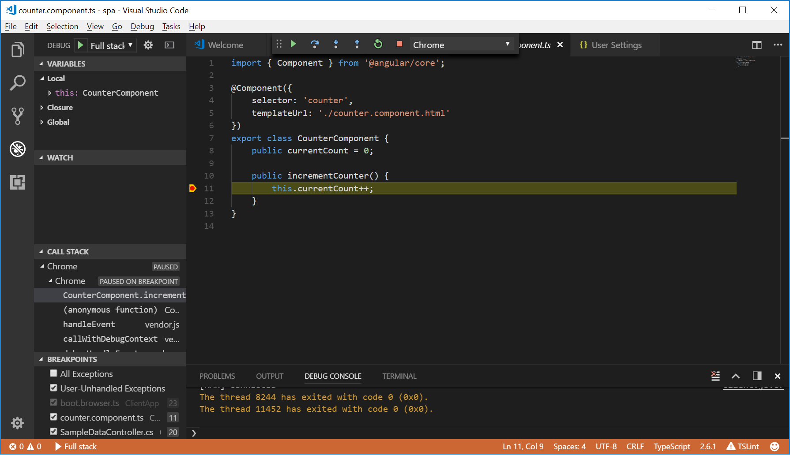
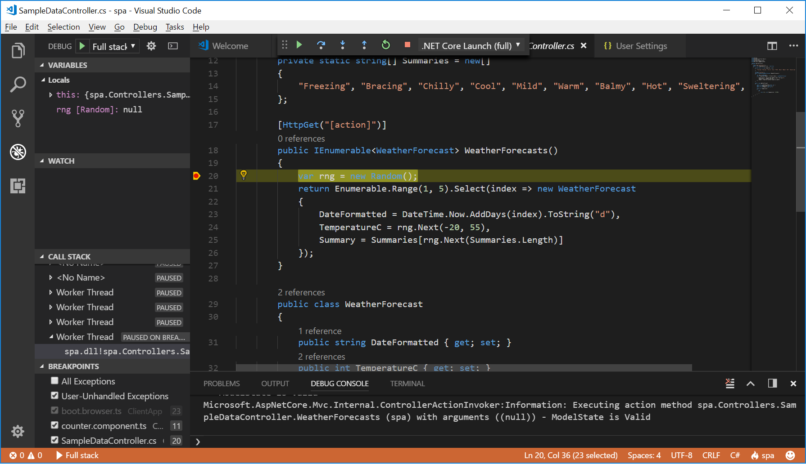

# Debugging both Typescript and C# with Angular AspNetCore.SpaTemplates

by [John Pankowicz](https://github.com/johnpankowicz)

This recipe shows how to use both the [Debugger for Chrome](https://github.com/Microsoft/vscode-chrome-debug) extension and the [C# for Visual Studio Code](https://github.com/OmniSharp/omnisharp-vscode) extention together to debug a C#/Typescript application generated by the [Angular AspNetCore.SpaTemplates](https://www.nuget.org/packages/Microsoft.AspNetCore.SpaTemplates/).

## Prerequisites to install

- [Google Chrome](https://www.google.com/chrome) installed in its default location.

- Version **3.5.0** or greater of the [Debugger for Chrome](https://marketplace.visualstudio.com/items?itemName=msjsdiag.debugger-for-chrome) extension installed in VS Code.

- Version **1.13.1** of the [C# for Visual Studio Code](https://marketplace.visualstudio.com/items?itemName=ms-vscode.csharp) extension installed in VS Code.

- .NET Core SDK 1.0 RC4 (or later) for Windows, Mac, or Linux

  ( See: [Building Single Page Applications on ASP.NET Core with JavaScriptServices](https://blogs.msdn.microsoft.com/webdev/2017/02/14/building-single-page-applications-on-asp-net-core-with-javascriptservices/) )
  
- Node.js, version 6 or later

## Getting Started

- To install the Single Page Application (SPA) templates, run the following command:

    ```
    dotnet new --install Microsoft.AspNetCore.SpaTemplates::*
    ```

- Use SpaTemplates to create a new Angular application.

    ```
    mkdir my-app
    cd my-app
    dotnet new amgular
    ```

- Retore dependencies

    ```
    dotnet restore
    npm install
    ```

- Open VS Code.

    ```
    code .
    ```

Vscode might ask: "Required assets to build and debug are missing from your project. Add them?"
If so, choose Yes. This will add a .vscode directory with a launch.json and tasks.json file. 

## Configure launch.json File

- Click on the Debugging icon in the Activity Bar to bring up the Debug view.
Then click on the gear icon to configure a launch.json file:

- Add the following configurations to the "configurations" array:

  ```json
  {
   "version": "0.2.0",
   "configurations": [
        {
            "name": ".NET Core Launch (full)",
            "type": "coreclr",
            "request": "launch",
            "preLaunchTask": "build",
            // If you have changed target frameworks, make sure to update the program path.
            "program": "${workspaceFolder}/bin/Debug/netcoreapp2.0/spa.dll",
            "args": [],
            "cwd": "${workspaceFolder}",
            "stopAtEntry": false,
            "internalConsoleOptions": "openOnSessionStart",
            "launchBrowser": {
                "enabled": false
            },
            "env": {
                "ASPNETCORE_ENVIRONMENT": "Development"
            },
            "sourceFileMap": {
                "/Views": "${workspaceFolder}/Views"
            }
        },
        {
            "type": "chrome",
            "request": "launch",
            "name": "Chrome",
            "url": "http://localhost:5000",
            "webRoot": "${workspaceRoot}/wwwroot"
        }
    ],
    "compounds": [
        {
            "name": "Full stack",
            "configurations": [".NET Core Launch (full)", "Chrome"]
        }
    ]
  }
  ```

  ## Start Debugging

- Set a Typescript breakpoint in **ClientApp\app\components\counter\counter.component.ts** on the line:

    ```
    this.currentCount++;
    ```

- Set a C# breakpoint in **Controllers\SampleDataController.cs** on the line:

    ```
    var rng = new Random();
    ```

- Go to to the Debug view, select the **'Full stack'** configuration, then press F5 or click the green arrow.

- When a browser opens with the sample application, click "Counter" in the left navigation bar.
Click "Increment".  You should then hit the Typescript breakpoint:

  

- Hit F5 or the green arrow in VSCode to continue execution.

- Click "Fetch Data" in the left navigation bar. You should then hit the C# breakpoint.

  

