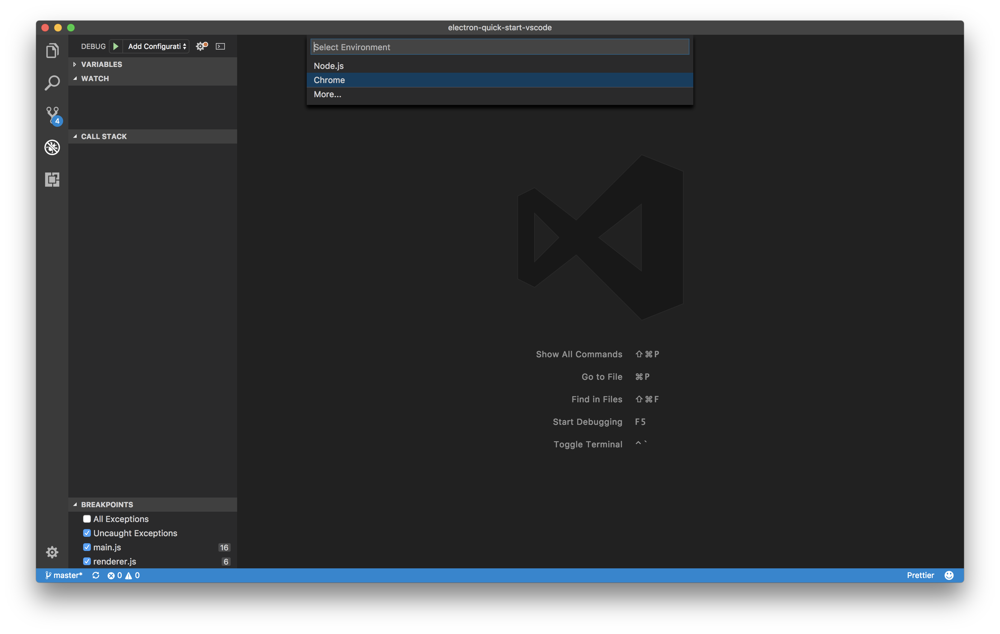
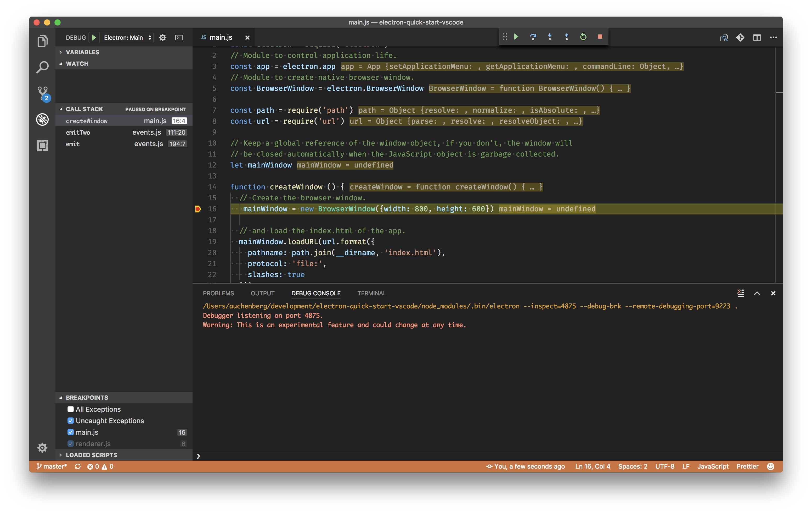
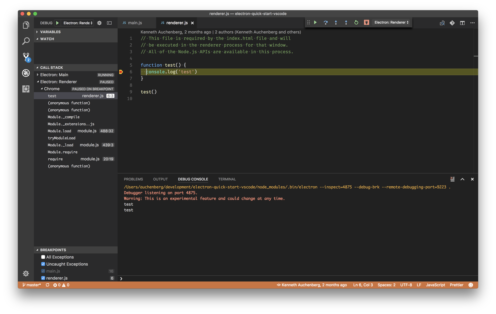

# Electron debugging (main and renderer process)

By [Kenneth Auchenberg](https://twitter.com/auchenberg)

This recipe shows how to use the built-in Node Debugger and the [Debugger for Chrome](https://github.com/Microsoft/vscode-chrome-debug) extension with VS Code to debug [Electron](https://electron.atom.io) applications.

[Electron](https://electron.atom.io) applications can consist of two process types: a main process type running in NodeJS, and a renderer process type in Chromium. This means that you'll need to use two debugger instances within VS Code to debug both processes. This is the reason you'll need both the built-in Node Debugger and the [Debugger for Chrome](https://github.com/Microsoft/vscode-chrome-debug) extension.

**Note:** Please make sure you are using **Electron 1.7.4 or newer**, as our debuggers rely on the inspector protocol.

## Getting Started

1. Make sure you're running the latest version of VS Code.

2. Also make sure the latest version of the [Debugger for Chrome](https://marketplace.visualstudio.com/items?itemName=msjsdiag.debugger-for-chrome) extension is installed in VS Code.

3. This guide assumes that you are using the [electron-quick-start project](https://github.com/electron/electron-quick-start). Clone the repo to get started:
    >
    ```
    git clone https://github.com/electron/electron-quick-start.git
    cd electron-quick-start
    npm install
    code .
    ```

## Configure launch.json File

- Click on the Debugging icon in the Activity Bar (or press Cmd/Ctrl+Shift+D) to bring up the Debug view.
Then click on the gear icon to configure a launch.json file, selecting **Chrome** for the environment:

   

- Replace content of the generated launch.json with the following two configurations:

  ```json
    {
        "version": "0.2.0",
        "configurations": [
            {
                "type": "node",
                "request": "launch",
                "name": "Electron: Main",
                "protocol": "inspector",
                "runtimeExecutable": "${workspaceFolder}/node_modules/.bin/electron",
                "runtimeArgs": [
                    "--remote-debugging-port=9223",
                    "."
                ],
                "windows": {
                    "runtimeExecutable": "${workspaceFolder}/node_modules/.bin/electron.cmd"
                }
            },
            {
                "name": "Electron: Renderer",
                "type": "chrome",
                "request": "attach",
                "port": 9223,
                "webRoot": "${workspaceFolder}",
                "timeout": 30000
            }
        ],
        "compounds": [
            {
                "name": "Electron: All",
                "configurations": [
                    "Electron: Main",
                    "Electron: Renderer"
                ]
            }
        ]
    }
  ```

## Debugging the Main Process

 1. Set a breakpoint in **main.js** on `line 16` within the `createWindow` function by clicking the gutter to the left of the line number.

 2. Go to the Debug view and select the **'Electron: Main'** configuration, then press F5 or click the green play button.

 3. VS Code should now attempt to start your Electron app, and your breakpoint on `line 16` in `main.js` should be hit.



## Debugging the Renderer Process

  1. Update the contents of `renderer.js` to
 ```javascript
    // This file is required by the index.html file and will
    // be executed in the renderer process for that window.
    // All of the Node.js APIs are available in this process.

    function test() {
        console.log('test')
    }

    test()
```

  2. While your debug session is running, you can go to the Debug view and select the **'Electron: Renderer'** configuration, which will connect VS Code to the Electron renderer process.

  3. When connected, go to `renderer.js` and set a breakpoint on `line 6`.

  4. Now go to your Electron app window and reload the page (View -> Reload or Cmd/Ctrl+R) to make sure the breakpoints are set.

  5. Your breakpoint in `renderer.js` on `line 6` should now be hit, and you can debug the Renderer process.



## Debugging Both Processes Simultaneously

Now that you have learned to debug both the Main and Renderer processes, you can take advantage of our [`compound configurations`](https://code.visualstudio.com/updates/v1_8#_multitarget-debugging) that enable you to start multiple debugging sessions at the same time.

1. Go to the Debug view and select **'Electron: All'**, which will connect VS Code to both the Main and Renderer processes and enable you to have a smooth development workflow.
2. Set breakpoints in any of the files like above.
3. Party 🎉🔥


