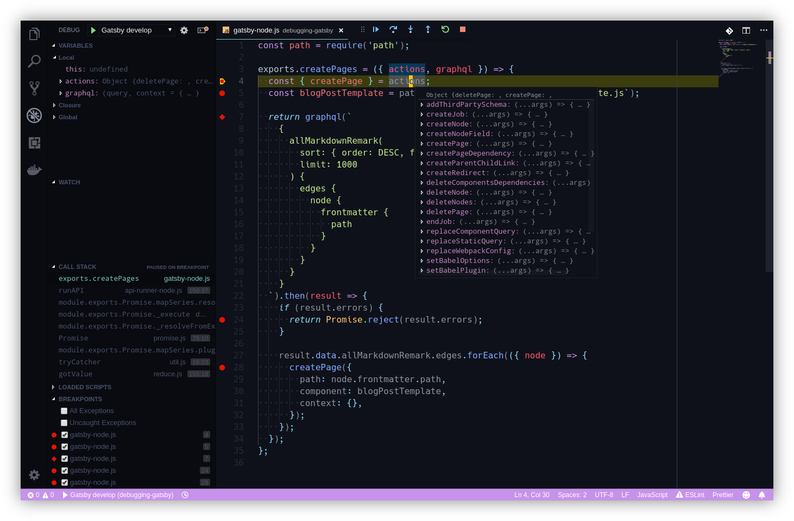

# Debugging Gatsby.js build process

by [André Vargas (@andrevargas)](https://github.com/andrevargas)

[Gatsby](https://www.gatsbyjs.org/) is a site generator for React. It generates static builds with content from any kind of data sources. In order to create the static resources, it runs a **build process** using Node.js. Since it's a simple Node.js process, we can debug it using VS Code!

This guide shows how to use the built-in Node debugger to debug Gatsby **build process** only. If you are interested in debugging the app in runtime, take a look at the [Debugging React apps](https://medium.com/@auchenberg/live-edit-and-debug-your-react-apps-directly-from-vs-code-without-leaving-the-editor-3da489ed905f) guide.

## Getting started
### Requirements
1. The latest version of VS Code installed.
2. A project initialized with [Gatsby CLI](https://www.npmjs.com/package/gatsby-cli).

## Configure `launch.json` file
1. Open your project folder in VS Code.
2. Click on the **Debug** icon in the Activity Bar to switch to the Debug view.
3. Click on the **gear** ⚙ icon to create a `launch.json` file.
4. In the **Select Environment** input, select **Node.js**.

5. Replace the content of the generated `launch.json` file with the following configuration:
```json
{
  "version": "0.2.0",
  "configurations": [
    {
      "name": "Gatsby develop",
      "type": "node",
      "request": "launch",
      "protocol": "inspector",
      "program": "${workspaceRoot}/node_modules/gatsby/dist/bin/gatsby",
      "args": ["develop"],
      "stopOnEntry": false,
      "runtimeArgs": ["--nolazy"],
      "sourceMaps": false
    },
    {
      "name": "Gatsby build",
      "type": "node",
      "request": "launch",
      "protocol": "inspector",
      "program": "${workspaceRoot}/node_modules/gatsby/dist/bin/gatsby",
      "args": ["build"],
      "stopOnEntry": false,
      "runtimeArgs": ["--nolazy"],
      "sourceMaps": false
    }
  ]
}
```
>This JSON file defines two configurations, one for `gatsby develop` command and another for `gatsby build` command. The build process is executed in both commands, and both are debuggable.

## Debugging the build process
Gatsby lets you configure the build process through the `gatsby-node.js` file in your project. Assuming you have written a custom logic in there, you can debug it just like any other Node application!

1. Open the `gatsby-node.js` file.
2. Put a **breakpoint** 🔴 anywhere in the file.
3. Switch to the Debug view and select "**Gatsby build**" or "**Gatsby develop**" configuration.
4. Press `F5` or click on **Start debugging** (the green "play" button).
5. Tadaa! 🎉 Your breakpoint have been hit, and now you have full access to the variables and program flow.



## Aditional resources
* [Debugging <code.visualstudio.com>](https://code.visualstudio.com/docs/editor/debugging)
* [Debugging the build process <gatsbyjs.org>](https://www.gatsbyjs.org/docs/debugging-the-build-process/)

