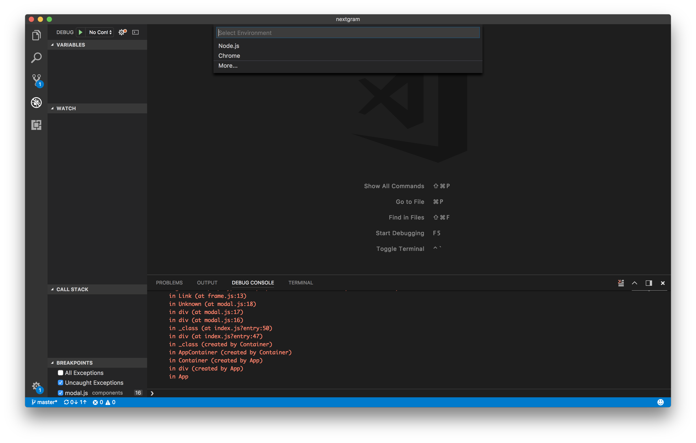
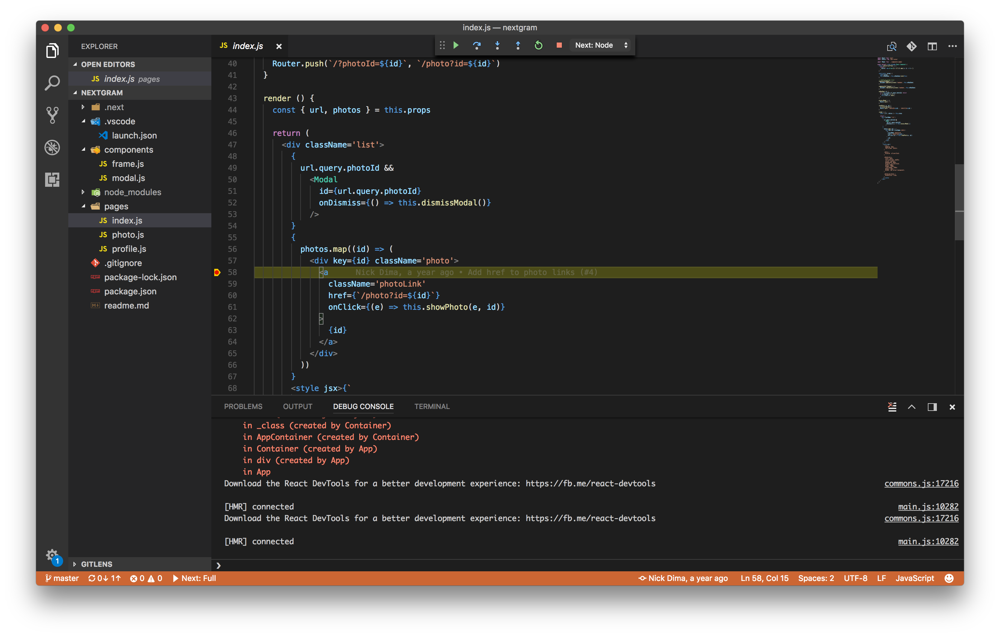
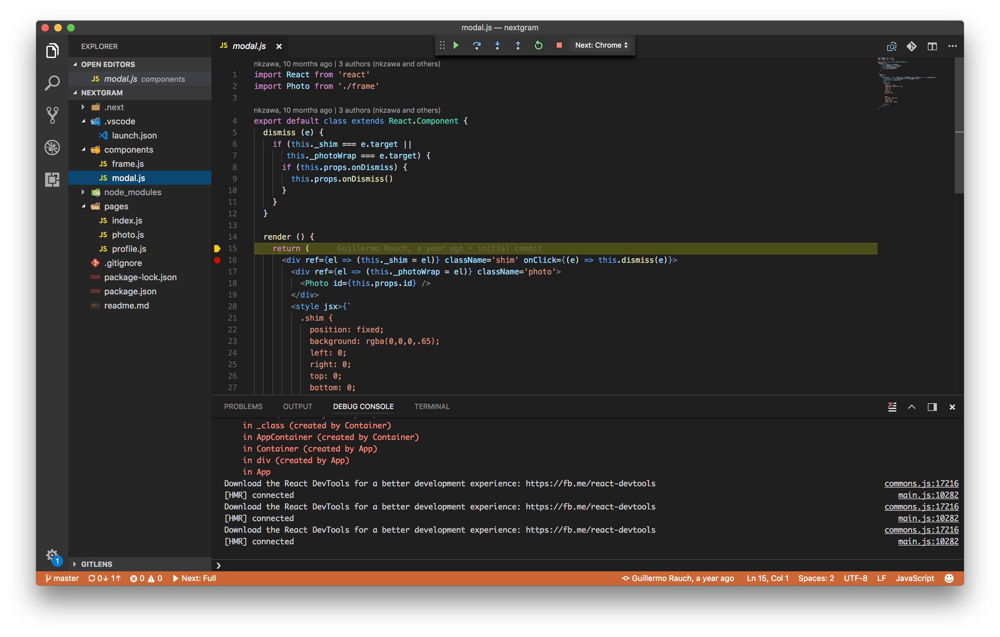

# Next.js debugging in VS Code (Node and Chrome)

by [Kenneth Auchenberg](https://twitter.com/auchenberg)

This recipe shows how to use the built-in Node Debugger and the [Debugger for Chrome](https://github.com/Microsoft/vscode-chrome-debug) extension with VS Code to debug [next.js](https://github.com/zeit/next.js) applications.

Next.js allows ReactJS to be used both on the server and client, which is a great match for VS Code, as we can debug both the server and client at the same time! This means that you'll need to use two debugger instances within VS Code to debug both ends. This is the reason for why you'll need both the built-in Node Debugger and the [Debugger for Chrome](https://github.com/Microsoft/vscode-chrome-debug).

**Note:** Please make sure you are using **Next.js 4.2.0-canary.1 or newer**, as our debuggers relies on source maps, and there's been a bunch of improvements for this in next.js.

## Getting Started

1. Make sure to have the latest version of VS Code installed.

2. Make sure to the latest version of [Debugger for Chrome](https://marketplace.visualstudio.com/items?itemName=msjsdiag.debugger-for-chrome) extension installed in VS Code.

3. This guide assumes that you are using the official sample app [nextgram](https://github.com/zeit/nextgram). Clone the repo to get started
    >
    ```
    git clone git@github.com:now-examples/nextgram.git
    cd nextgram
    npm install
    code .
    ```

## Configure next.js to run in Debug mode

Next.js can be started in `debug mode` by using the `--inspect` flag like regular Node processes. We have contributed this in [PR3294](https://github.com/zeit/next.js/pull/3294) for Next.js, so you'll have to remember to start your `next` process with this flag, as VS Code otherwise won't be able to connect to your Node process and debug your server-side code. The following `launch.json` sets this flag for you, but if you start your Next process in different way, remember to add this flag.

## Configure launch.json File

- Click on the Debugging icon in the Activity Bar to bring up the Debug view.
Then click on the gear icon to configure a launch.json file, selecting **Chrome** for the environment:

   

- Replace content of the generated launch.json with the following two configurations:

```json
{
    "version": "0.2.0",
    "configurations": [
        {
            "type": "chrome",
            "request": "launch",
            "name": "Next: Chrome",
            "url": "http://localhost:3000",
            "webRoot": "${workspaceFolder}"
        },
        {
            "type": "node",
            "request": "launch",
            "name": "Next: Node",
            "runtimeExecutable": "npx",
            "runtimeArgs": [
                "next",
                "--inspect"
            ],
            "port": 9229,
            "console": "integratedTerminal"
        }
    ],
    "compounds": [
        {
            "name": "Next: Full",
            "configurations": ["Next: Node", "Next: Chrome"]
        }
    ]
}
  ```

  ## Debugging of the Node process

  1. Go to the Debug view, select the **'Next: Node'** configuration, then press F5 or click the green play button.

  2. VS Code should now attempt to start your Next app.

  3. Go ahead and set a breakpoint in **pages/index.js** on `line 56` within the `render` function.



  4. Open your favorite browser and go to `http://localhost:3000`

  5. Your breakpoint should now be hit.

## Debugging of the renderer (Chrome) process

  1. While your debug session is running you can go to the Debug view, select the **'Next: Chrome'**, which will launch Google Chrome and connect VS Code to the renderer process.

  3. When connected go to `component/modal.js` and set a breakpoint on `line 16`

  4. Now go to your Google Chrome window and click one of the images that opens in a modal.

  5. Your breakpoint in `component/modal.js` on `line 16` should now be hit, and you can debug the logic.



## Debugging of both Node and Chrome at the same time

Now that you have learned to debug both the Main and the Renderer process, you can take advantage of our [`compounds configurations`](https://code.visualstudio.com/updates/v1_8#_multitarget-debugging) that enables you to start multiple debugging sessions at the same time.

1. Go to the Debug view, select the **'Next: All'**, which will connect VS Code to the both Main and Renderer process, and enable you to have a smooth development workflow.
2. Set breakpoints in any of the files like above.
3. Party 🎉🔥
