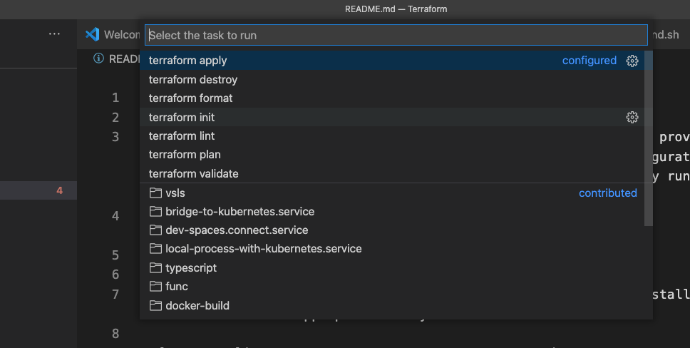

# Running Terraform in VS Code

[Terraform](https://www.terraform.io/) is an open-source tool that provides the ability to build, change, and version infrastructure as code using declarative configuration files with HashiCorp Configuration Language (HCL). This recipe shows how to successfully run Terraform with minimal setup with VS Code.

## Getting Started

- [Visual Studio Code](https://code.visualstudio.com/download): Install the latest version of Visual Studio Code that is appropriate for your environment.

- [Terraform](https://www.terraform.io/downloads.html): Download the latest version of Terraform that is appropriate for your environment.

- [Terraform Extension](https://marketplace.visualstudio.com/items?itemName=HashiCorp.terraform): The HashiCorp Terraform VS Code extension adds syntax highlighting and other editing features for Terraform files using the Terraform Language Server.

- [Terraform Linter](https://github.com/terraform-linters/tflint)

## Configuring the Terraform Tasks

The tasks below are based on Microsoft Azure as the cloud provider but other cloud provides such as AWS and Google Cloud are also supported with Terraform.

Add/Update your vscode settings.json with:

```json
{
    "terraform" : {
        "azurerm" : {
            "tenant_id" : "", // your target tenant id 
            "subscription_id" : "", // your target subscription id
            "location" : "eastus",
            "backend" : {            
                "storage_account" : "sttrfrmrecipe",
                "resource_group" : "rg-trfrm-recipe",
                "container" : "infrax",
                "key" : "infrax.tfstate"
            }
        }
    }
}
```

Add the following `shell` task to your tasks.json file:

```json
{
    "version": "2.0.0",
    "windows": {
        "options": {
            "shell": {
                "executable": "cmd.exe",
                "args": ["/d", "/c"],
            },
        }
    },
    "tasks": [
        {
            "label": "az login",
            "type": "shell",
            "command": "az login && az account set -s ${config:terraform.azurerm.subscription_id}",
            "problemMatcher": []
        },
        {
            "label": "terraform create backend",
            "type": "shell",
            "command": "${workspaceFolder}/create-backend.sh",
            "problemMatcher": [],
            "args": [
                "${config:terraform.azurerm.backend.resource_group}",
                "${config:terraform.azurerm.backend.storage_account}",
                "${config:terraform.azurerm.backend.container}",
                "${config:terraform.azurerm.location}"
            ]
        },
        {
            "label": "terraform init",
            "type": "shell",
            "command": "terraform",
            "problemMatcher": [],
            "args": [
                "init",
                "-backend-config=\"resource_group_name=${config:terraform.azurerm.backend.resource_group}\"",   
                "-backend-config=\"storage_account_name=${config:terraform.azurerm.backend.storage_account}\"",
                "-backend-config=\"container_name=${config:terraform.azurerm.backend.container}\"",
                "-backend-config=\"key=${config:terraform.azurerm.backend.key}\"",                           
                "-backend-config=\"subscription_id=${config:terraform.azurerm.subscription_id}\"",
                "-backend-config=\"tenant_id=${config:terraform.azurerm.tenant_id}\"",
            ],
            "options": {
                "cwd": "${workspaceFolder}/templates"
            }
        },
        {
            "label": "terraform validate",
            "type": "shell",
            "options": {
                "cwd": "${workspaceFolder}/templates"
            },
            "command": "terraform",
            "problemMatcher": [],
            "args": [
                "validate"
            ]
        },
        {
            "label": "terraform format",
            "type": "shell",
            "options": {
                "cwd": "${workspaceFolder}/templates"
            },
            "command": "terraform",
            "problemMatcher": [],
            "args": [
                "fmt",
                "--recursive"
            ]   
        },
        {
            "label": "terraform lint",
            "type": "shell",
            "options": {
                "cwd": "${workspaceFolder}/templates"
            },
            "command": "tflint",
            "problemMatcher": []
        },
        {
            "label": "terraform plan",
            "type": "shell",
            "options": {
                "cwd": "${workspaceFolder}/templates"
            },
            "command": "terraform",
            "problemMatcher": [],
            "args": [
                "plan"
            ]
        },
        {
            "label": "terraform apply",
            "type": "shell",
            "options": {
                "cwd": "${workspaceFolder}/templates"
            },
            "command": "terraform",
            "problemMatcher": [],
            "args": [
                "apply"
            ]
        },
        {
            "label": "terraform destroy",
            "type": "shell",
            "options": {
                "cwd": "${workspaceFolder}/templates"
            },
            "command": "terraform",
            "problemMatcher": [],
            "args": [
                "destroy"
            ]
        },
    ]
}
```

## Running the Terraform Commands

### Using the VS Code Tasks

VS Code tasks have been configured to run commonly used  commands. These can be accessed via `CTRL/Command+SHIFT+P` > `Tasks: Run Tasks`.



Add section for env settings [TBD]

### Running the Tasks

Once the environment settings are configured, and the backend has been created, you can begin executing terraform commands. VS Code tasks have been configured to run each of the commonly used terraform commands. These can be accessed via `CTRL/Command+SHIFT+P` > `Tasks: Run Tasks`.

- `az login`: login to Azure
- `terraform create backend`: creates (if it does not exists) a remote azurerm backend (storage account)
- `terraform init`: installs plugins and connects to terraform remote backend
- `terraform fmt`: fix formatting issues
- `tflint`: fix linting issues
- `terraform validate`: checks templates for syntax errors
- `terraform plan`: reports what would be done with apply without actually deploying any resources
- `terraform apply`: deploys the terraform templates
- `terraform destroy`: remove anything deployed with the templates

## Sample Project

In this short [sample](), we create and execute the basic Terraform configuration that will provision a new Azure Resource Group.

## Additional References

- [Terraform Overview](https://www.terraform.io/intro/index.html)
- [Terraform Tutorials](https://learn.hashicorp.com/terraform?utm_source=terraform_io)
