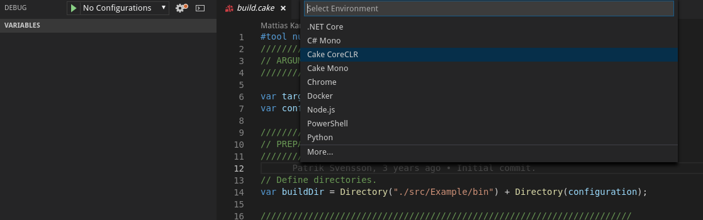
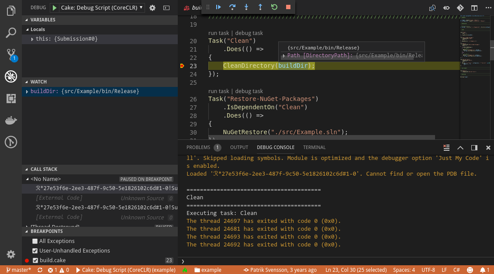

# Cake Debugging with VS Code

by [Alistair Chapman(@agc93)](https://github.com/agc93)

This recipe shows how to debug [Cake](https://cakebuild.net) scripts from within VS Code.

## Prerequisites

This guide will use the [Cake example project](https://github.com/cake-build/example) as a sample, but you should be able to use these steps with any Cake build script.

Make sure you have the following already in place:

- The latest version of the [C# for Visual Studio Code](https://marketplace.visualstudio.com/items?itemName=ms-vscode.csharp) extension installed in VS Code.

- Also make sure you have the latest version of the [Cake for Visual Studio Code](https://marketplace.visualstudio.com/items?itemName=cake-build.cake-vscode) extension installed.

## Getting Started

- Open your workspace, then open the Command Palette (Ctrl-Shift-P by default) and find the *Cake: Install debug dependencies* command. Run the command, and after a few seconds you should receive a notification that dependencies have been enabled.


- If you now open the Debug panel in the Activity Bar and press the Gear icon to configure a new `launch.json`, you should see entries for Cake.



- Selecting *Cake CoreCLR* will add the following to your `launch.json`:

```json
{
    "version": "0.2.0",
    "configurations": [
        {
            "name": "Cake: Debug Script (CoreCLR)",
            "type": "coreclr",
            "request": "launch",
            "program": "${workspaceRoot}/tools/Cake.CoreCLR/Cake.dll",
            "args": [
                "${workspaceRoot}/build.cake",
                "--debug",
                "--verbosity=diagnostic"
            ],
            "cwd": "${workspaceRoot}",
            "stopAtEntry": true,
            "externalConsole": false
        }
    ]
}
```
> This configuration will launch Cake.CoreCLR using the default `build.cake` file in the workspace root with diagnostic verbosity and debugging enabled. If you want to debug a different script file, change the `${workspaceRoot}/build.cake` line to the location of your file.

- You can now set breakpoints on any line in your Cake file using the left margin or the F9 key.

- Finally, run the new debug configuration using from the Debug panel using either the green arrow or the F5 key.

- VS Code will stop on the breakpoint you set and you should have access to all the usual features of C# debugging including variables and watches, and you can even hover over symbols for real-time debugging.



> You can also quickly run or debug individual tasks using the *run task* and *debug task* shortcuts above each `Task`!