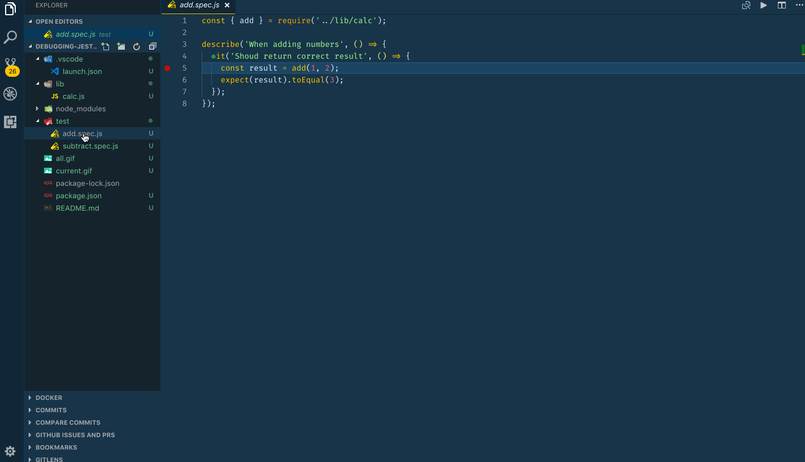
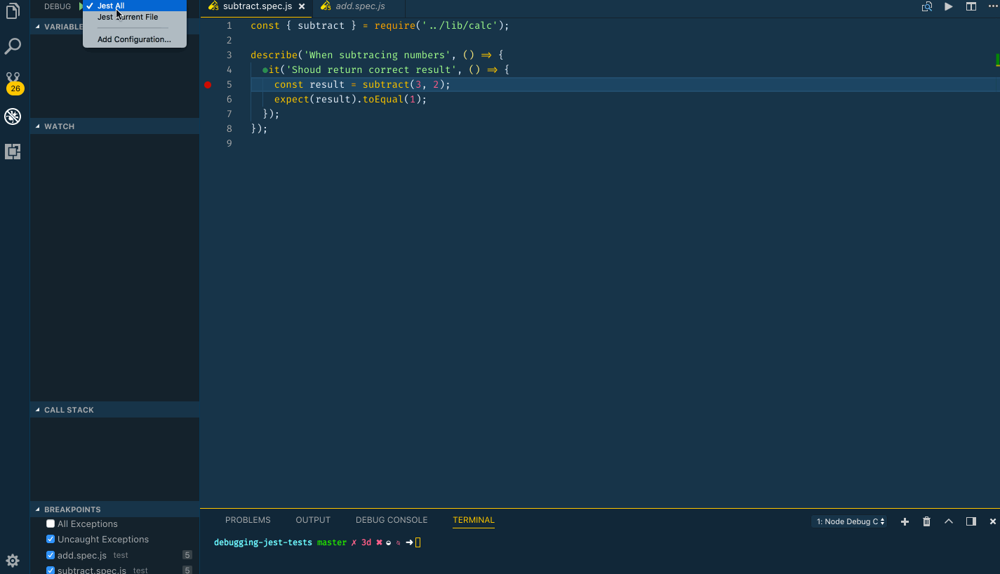

# Debugging tests in VS Code

by [Jag Reehal](https://twitter.com/jagreehal)

This recipe shows how to use the built-in Node Debugger to debug [Jest](https://facebook.github.io/jest/) tests.

## The example

The test folder contains two files that test the lib/calc.js file.

To try the example you'll need to install dependencies by running:

`npm install`

## Configure launch.json File for your test framework

* Click on the Debugging icon in the Activity Bar to bring up the Debug view.
  Then click on the gear icon to configure a launch.json file, selecting **Node** for the environment:

* Replace content of the generated launch.json with the following configurations:

```json
{
  "version": "0.2.0",
  "configurations": [
    {
      "type": "node",
      "request": "launch",
      "name": "Jest All",
      "program": "${workspaceFolder}/node_modules/.bin/jest",
      "args": ["--runInBand"],
      "console": "integratedTerminal",
      "internalConsoleOptions": "neverOpen",
      "disableOptimisticBPs": true,
      "windows": {
        "program": "${workspaceFolder}/node_modules/jest/bin/jest",
      }
    },
    {
      "type": "node",
      "request": "launch",
      "name": "Jest Current File",
      "program": "${workspaceFolder}/node_modules/.bin/jest",
      "args": [
        "${fileBasenameNoExtension}",
        "--config",
        "jest.config.js"
      ],
      "console": "integratedTerminal",
      "internalConsoleOptions": "neverOpen",
      "disableOptimisticBPs": true,
      "windows": {
        "program": "${workspaceFolder}/node_modules/jest/bin/jest",
      }
    }
  ]
}
```

## Configure package.json File for your test framework
* Add following Jest configuration to package.json:
```
"jest": {
   "testEnvironment": "node"
}
```

**Note for windows users** : if `node_modules/jest` is not available in your project, but `node_modules/jest-cli` is installed (e.g. if you are [using react-boilerplate](https://github.com/react-boilerplate/react-boilerplate/blob/v3.6.0/package.json#L221)) you can replace the windows attribute by this one for both launch configurations :

```json
"windows": {
  "program": "${workspaceFolder}/node_modules/jest-cli/bin/jest",
}
```

## Debugging all tests

You can debug all tests by following the steps below:

1. Set a breakpoint in a test file or files.

2. Go to the Debug view, select the **'Jest All'** configuration, then press F5 or click the green play button.

3. Your breakpoint will now be hit.

> **Note**: Your breakpoint may not be hit on the first run. If it isn't hit, you can rerun the tests by pressing `a` at the prompt in the Terminal. Or, by adding a `debugger` statement to the top of the script (this just gives vscode time to process the script's sourcemaps when it is loaded).



## Debugging the current test

You can debug the test you're editing by following the steps below:

1. Set a breakpoint in a test file.

2. Go to the Debug view, select the **'Jest Current File'** configuration, then press F5 or click the green play button.

3. Your breakpoint will now be hit. (If not, see **Note** above).


