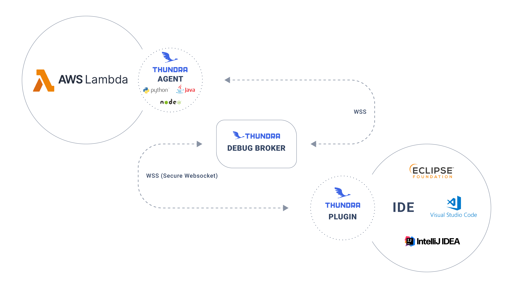
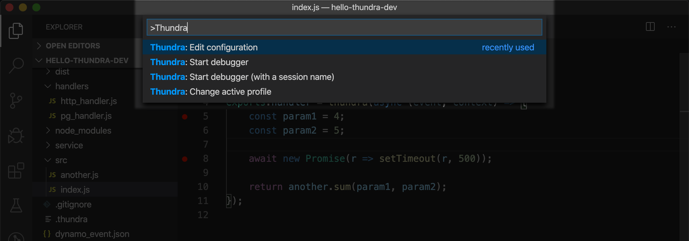
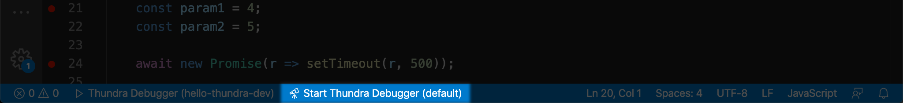
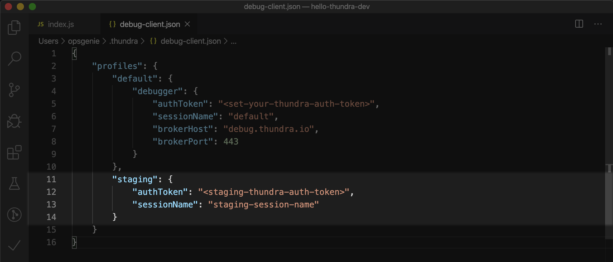
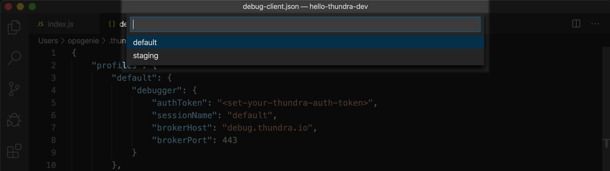

# Debugging AWS Lambda functions with Thundra

by [Serkan Özal (@serkan-ozal)](https://github.com/serkan-ozal)

[Thundra](https://thundra.io/apm) is tracing and debugging solution for serverless applications and modern cloud native applications. 
Thundra Online AWS Lambda debugger allows you to debug AWS Lambda functions on the real AWS Lambda environment. 
So you can debug your AWS Lambda functions by putting breakpoints locally, evaluating expressions at runtime, checking call traces, etc ...


Thundra's AWS Lambda debugger solution sets up a secure bridge between the AWS Lambda environment and your debugger on IDE via a web socket communication. 
This allows you to debug your applications like you could debug any code that you host on your computer with native debugging actions, enabling you to see the values of local variables and the entire stack trace.
As can be seen in the image below, we set up a secure bridge to exchange data between the AWS Lambda environment and the IDE. The bridge encrypts the data while exchanging it between several nodes.



See [here](https://apm.docs.thundra.io/debugging/online-debugging) for more details.

## Getting started

### Requirements

- The latest version of VSCode installed.

### Installation

- Install the extension from the [VSCode marketplace](https://marketplace.visualstudio.com/items?itemName=thundra.thundra-debugger).
- Sign up for [Thundra](https://start.thundra.io), go to [APM](https://apm.thundra.io) and select the Thundra Debugger option to receive your authentication key. If you’ve already signed up, you can get your key from [the settings page](https://apm.thundra.io/settings/debugger).
- Open the Command Palette (`⇧⌘P`) and select the `Thundra: Edit Configuration` command to modify the configuration file.



- Set your authentication key to the variable `“authToken”` in your Thundra configuration file. [Learn how to get your authentication key](https://apm.docs.thundra.io/getting-started/quick-start-guide/thundra-debugger#how-to-get-authentication-key-for-thundra-debugger).

```json
{
    "profiles": {
        "default": {
            "debugger": {
            "authToken": <set-your-thundra-auth-token>,
            "sessionName": "default",
            "brokerHost": "debug.thundra.io",
            "brokerPort": 443
        }
    }
}
```

### How to Use

- Set a debugging point on your AWS Lambda function.
Execute the command `Thundra: Start Debugger` to start the debugging session. (Alternatively, you can click on the `Start Thundra Debugger` button on the Status Bar.)



- Now invoke your AWS Lambda function to hit on the debugging point.
- The debugging session ends when your AWS Lambda function times out. You can update the timeout of your function for longer sessions.
- To manage your Thundra Debugger profiles:
  - Open the Thundra configuration file by executing the command `Thundra: Edit Configuration`.
  - Add new profiles to the file as shown below.
  

  
- You can change your active profile by executing the command `Thundra: Change active profile` to use the Thundra Debugger with different configurations.



In order to quickly start with a different session name:
- Execute the command `Thundra: Start Debugger (with a session name)`
- Enter a unique session name (this will not make changes to the configuration file).
- Invoke the Lambda function and start debugging.

While debugging a lambda function using Thundra's online debugger, if the local root does not match the remote root; 
VSCode might not be able to resolve the breakpoint locations. 
If you put a breakpoint in your Lambda function, the function is connected however debugger is not stopping at the breakpoint; 
the problem might be related to the local root.
To solve this issue you can use the `Thundra: Change local root` command provided by the Thundra's VSCode extension.

See [here](https://apm.docs.thundra.io/ide-integrations/vscode-plugin/changing-local-root) for more details.

### Commands

| Command                                        | Description                                                               |
| ---------------------------------------------- | ------------------------------------------------------------------------- |
| Thundra: Start Debugger                        | Starts the debugger with the current profile's settings.                  |
| Thundra: Start Debugger (with a session name)  | Starts the debugger with the given session name.                          |
| Thundra: Change active profile                 | Changes the active profile to the one given in your configuration file.   |
| Thundra: Edit configuration                    | Opens the file containing your debugger configuration so you can edit it. |
| Thundra: Change local root                     | Changes local root directory with the given path                          |
   
You can access all of the above commands from the command palette (`Cmd+Shift+P` or `Ctrl+Shift+P`).

## Additional resources

* [Thundra VSCode Plugin](https://apm.docs.thundra.io/ide-integrations/vscode-plugin)
* [Online Debugging for Node.js AWS Lambda Functions](https://apm.docs.thundra.io/node.js/online-debugging)
* [Online Debugging for Python AWS Lambda Functions](https://apm.docs.thundra.io/python/online-debugging)
* [Changing Local Root](https://apm.docs.thundra.io/ide-integrations/vscode-plugin/changing-local-root)
* [Online Debugging](https://apm.docs.thundra.io/debugging/online-debugging)
* [Self Hosted Broker](https://apm.docs.thundra.io/debugging/online-debugging/self-hosted-broker)
