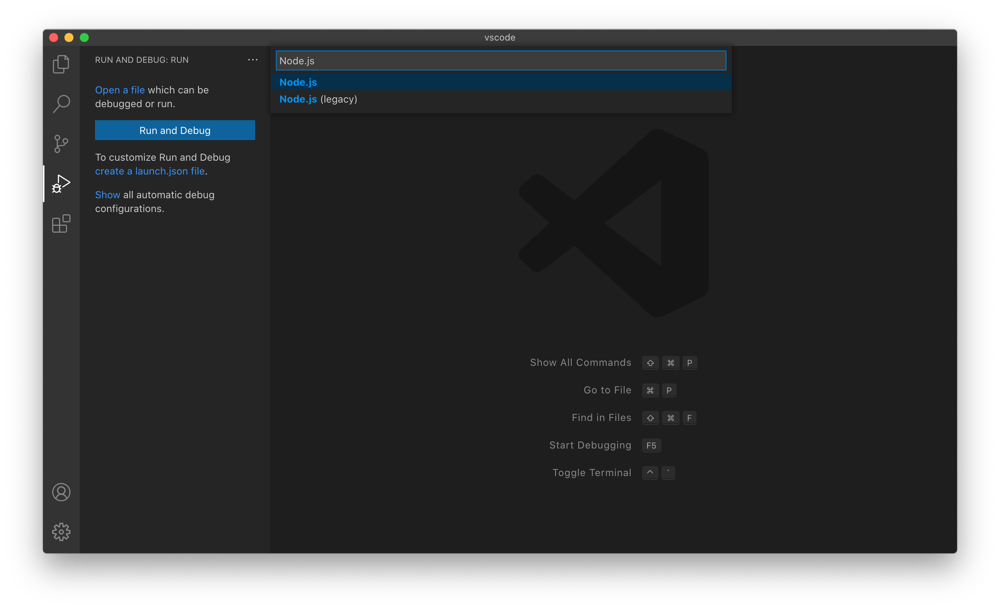
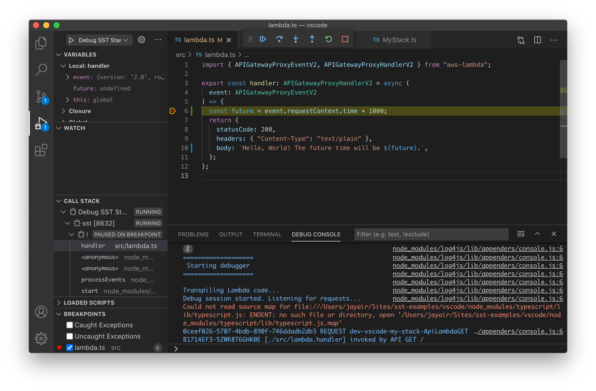

# Debugging AWS Lambda functions with SST

by [Jay V (@jayair)](https://github.com/jayair)

[SST](https://github.com/serverless-stack/serverless-stack) is a framework for building serverless applications. It allows you to [test and debug your Lambda functions locally](https://docs.serverless-stack.com/live-lambda-development) without having to redeploy your changes. It does this by streaming the Lambda function requests from AWS to your local client and running it locally. So for Node.js Lambda functions, you **can set breakpoints locally** and they'll reflect the event and context of the deployed Lambda function.

This guide will help you configure VS Code to support setting breakpoints and debugging your Lambda functions.

## Getting started

### Requirements

1. The latest version of VS Code installed.
2. A project initialized with the [SST CLI](https://docs.serverless-stack.com/installation).

## Configure `launch.json` file

1. Open your project folder in VS Code.
2. Click on the **Debug** icon in the Activity Bar to switch to the Debug view.
3. Under **Run and Debug** click on **create a launch.json file**.
4. In the **Select environment** input, select **Node.js**.

   

5. Replace the content of the generated `launch.json` file with the following configuration:

   ```json
   {
     "version": "0.2.0",
     "configurations": [
       {
         "name": "Debug SST Start",
         "type": "node",
         "request": "launch",
         "runtimeExecutable": "${workspaceRoot}/node_modules/.bin/sst",
         "runtimeArgs": ["start", "--increase-timeout"],
         "console": "integratedTerminal",
         "skipFiles": ["<node_internals>/**"]
       },
       {
         "name": "Debug SST Tests",
         "type": "node",
         "request": "launch",
         "runtimeExecutable": "${workspaceRoot}/node_modules/.bin/sst",
         "args": ["test", "--runInBand", "--no-cache", "--watchAll=false"],
         "cwd": "${workspaceRoot}",
         "protocol": "inspector",
         "console": "integratedTerminal",
         "internalConsoleOptions": "neverOpen",
         "env": { "CI": "true" },
         "disableOptimisticBPs": true
       }
     ]
   }
   ```

> This JSON file defines two configurations, one for the `sst start` command; to debug your Lambda functions. And another for the `sst test` command; to debug your tests.

## Debugging your Lambda functions

SST runs your Lambda functions locally and streams the requests back to AWS. So your functions can be debugged like any other Node.js application.

1. Open a Lambda function inside the `src/` directory.
2. Put a **breakpoint** 🔴 anywhere in the function.
3. Switch to the Debug view and select "**Debug SST Start**".
4. Press `F5` or click on **Start debugging**.
5. Tadaa! 🎉 Your breakpoint should be hit, and now you have full access to the event and context of the deployed Lambda function.



## Additional resources

* [Live Lambda Development](https://docs.serverless-stack.com/live-lambda-development)
* [How to debug Lambda functions with Visual Studio Code](https://serverless-stack.com/examples/how-to-debug-lambda-functions-with-visual-studio-code.html)
