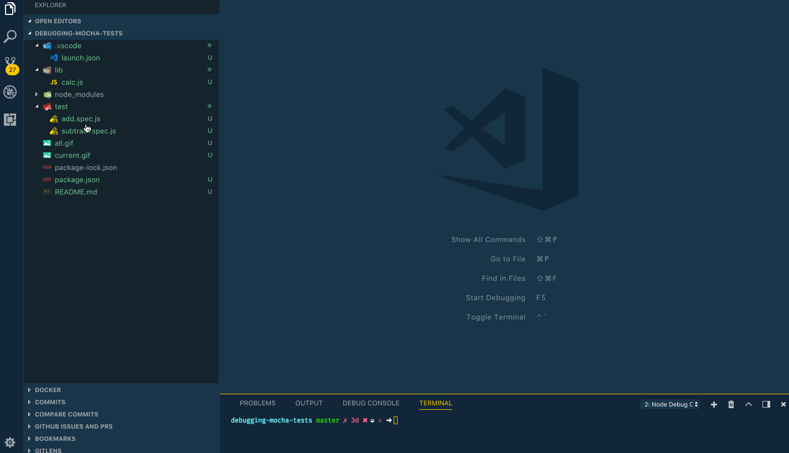

# Debugging tests in VS Code

by [Jag Reehal](https://twitter.com/jagreehal)

This recipe shows how to use the built-in Node Debugger to debug [Mocha](https://mochajs.org/) tests.

## The example

The test folder contains two files that test the lib/calc.js file.

To try the example you'll need to install dependencies by running:

`npm install`

## Configure launch.json File for your test framework

* Click on the Debugging icon in the Activity Bar to bring up the Debug view.
  Then click on the gear icon to configure a launch.json file, selecting **Node** for the environment:

* Replace content of the generated launch.json with the following configurations:

```json
{
  "version": "0.2.0",
  "configurations": [
    {
        "type": "node",
        "request": "launch",
        "name": "Mocha All",
        "program": "${workspaceFolder}/node_modules/mocha/bin/_mocha",
        "args": [
            "--timeout",
            "999999",
            "--colors",
            "${workspaceFolder}/test"
        ],
        "console": "integratedTerminal",
        "internalConsoleOptions": "neverOpen",
        "skipFiles": [
            "<node_internals>/**/*.js"
        ]
    },
    {
        "type": "node",
        "request": "launch",
        "name": "Mocha Current File",
        "program": "${workspaceFolder}/node_modules/mocha/bin/_mocha",
        "args": [
            "--timeout",
            "999999",
            "--colors",
            "${file}"
        ],
        "console": "integratedTerminal",
        "internalConsoleOptions": "neverOpen",
        "skipFiles": [
            "<node_internals>/**/*.js"
        ]
    }
  ]
}
```

If you don't have all of your tests under a common "test" directory, then the following configurations can be used. It will recursively search for all \*.test.js files except for those that are in a node_modules directory.

```json
{
  "version": "0.2.0",
  "configurations": [
    {
        "type": "node",
        "request": "launch",
        "name": "Mocha All",
        "program": "${workspaceFolder}/node_modules/mocha/bin/_mocha",
        "args": [
            "--timeout",
            "999999",
            "--colors",
            "'${workspaceFolder}/{,!(node_modules)/}*/*.test.js'"
        ],
        "console": "integratedTerminal",
        "internalConsoleOptions": "neverOpen",
        "skipFiles": [
            "<node_internals>/**/*.js"
        ]
    },
    {
        "type": "node",
        "request": "launch",
        "name": "Mocha Current File",
        "program": "${workspaceFolder}/node_modules/mocha/bin/_mocha",
        "args": [
            "--timeout",
            "999999",
            "--colors",
            "${file}"
        ],
        "console": "integratedTerminal",
        "internalConsoleOptions": "neverOpen",
        "skipFiles": [
            "<node_internals>/**/*.js"
        ]
    }
  ]
}
```

If you are running mocha will multiple arguments, you may consider creating an opt file that store all these arguments (i.e name it as mocha.json).

Example file contents with mocha arguments:

```json
{
  "colors": true,
  "timeout": 999999
}
```

Reference the mocha config file with --config in configuration as shown below

```json
{
    "version": "0.2.0",
    "configurations": [
        {
            "type": "node",
            "request": "launch",
            "name": "Mocha Test All with Options",
            "program": "${workspaceFolder}/node_modules/mocha/bin/_mocha",
            "args": [
                "--config",
                "${workspaceFolder}/support/mocha.json",
                "${workspaceFolder}/test"
            ],
            "console": "integratedTerminal",
            "internalConsoleOptions": "neverOpen",
            "skipFiles": [
                "<node_internals>/**/*.js"
            ]
        }
    ]
}
```

Mocha supports [many configuration](https://mochajs.org/#configuring-mocha-nodejs), typical of modern command-line tools.

## Debugging all tests

You can debug all tests by following the steps below:

1. Set a breakpoint in a test file or files

2. Go to the Debug view, select the **'Mocha All'** configuration, then press F5 or click the green play button.

3. Your breakpoint will now be hit



## Debugging the current test

You can debug the test you're editing by following the steps below:

1. Set a breakpoint in a test file

2. Go to the Debug view, select the **'Mocha Current File'** configuration, then press F5 or click the green play button.

3. Your breakpoint will now be hit


