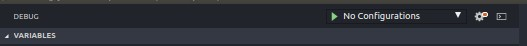
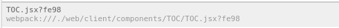

# Debugging webpack application

This procedure is tested with: 
 - webpack 2.2.1 - `devtool` option set to `eval-source-map`
 - Google Chrome 70.0.3538.67 
 - Ubuntu 16.04 LTS
 
1. Make you sure you have installed [chrome debug extension](https://github.com/Microsoft/vscode-chrome-debug)
2. Open debug section in Visual Studio Code 
3. click on "Configuration" selector (if you didn't set up any debug configuration yet, you will see "No Configuration") and select "Add Config (your project's name)". Then select "Chrome" as environment. 

Visual Studio Code will create a new file`.vscode/launch.json`. This file contains your debug and launch configuration.

You can edit the .vscode/launch.json as following: 

```
{
    "version": "0.2.0",
    "configurations": [
        {
          "type": "chrome",
          "request": "launch", // this launches a new browser's instance
          "name": "Launch Chrome against localhost",
          "url": "http://localhost:8081", // Your chrome URL 
          "webRoot": "${workspaceFolder}",
          "sourceMapPathOverrides": {
            "webpack:///*": "${workspaceRoot}/*" // indicate your source's base folder, in my case the root of the project
          }
        }
    ]
}
```

After this you can launch your application with webpack and run the visual studio debugger entry. (Clicking on the play button). 
A new browser's window will start

To verify the correctness of your settings, try to put a breakpoint in your code, when the debugger is running. If your breakpoint becomes grey (a tooltip says "Unverified Breakpoint" on mouse hover), maybe you did something wrong. 

## Troubleshooting
Webpack can be configured in many ways and versions . For this reason sometimes connecting it to debug tools, in general, is hard. 

Here some hints to check your configuration. 
 - Try to check how the files are mapped in chrome dev tools and try to edit `sourceMapPathOverrides` accordingly to the path of your files. you will see a path like `webpack:///{something}`. You have to verify that `sourceMapPathOverrides` correctly maps the files you want to debug.  
 - `devtool` configuration in webpack need to be have source maps. The simplest configuration of this kind is`'source-map'`. If your project is big, you may evaluate to use `'eval-source-map'`, `'inline-source-map'` or `'cheap-module-eval-source-map'` modes. This procedure has been tested with `source-maps` and `eval-source-map`.
 - Some webpack's versions seem to be affected by an issue with sourcemaps, at least using windows. You may need to add a configuration like this to work-around the problem: 
 ```
 output: {
  devtoolModuleFilenameTemplate(info) {
    return `file:///${info.absoluteResourcePath.replace(/\\/g, '/')}`;
  },
}
```
