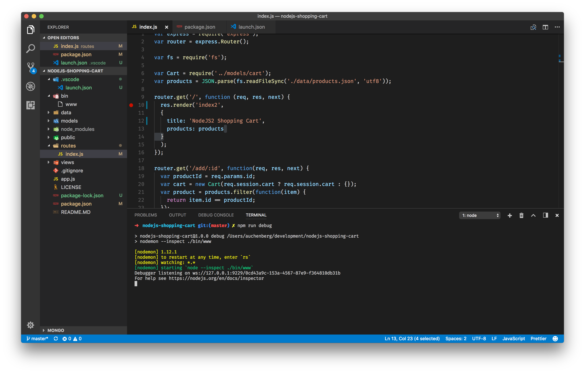
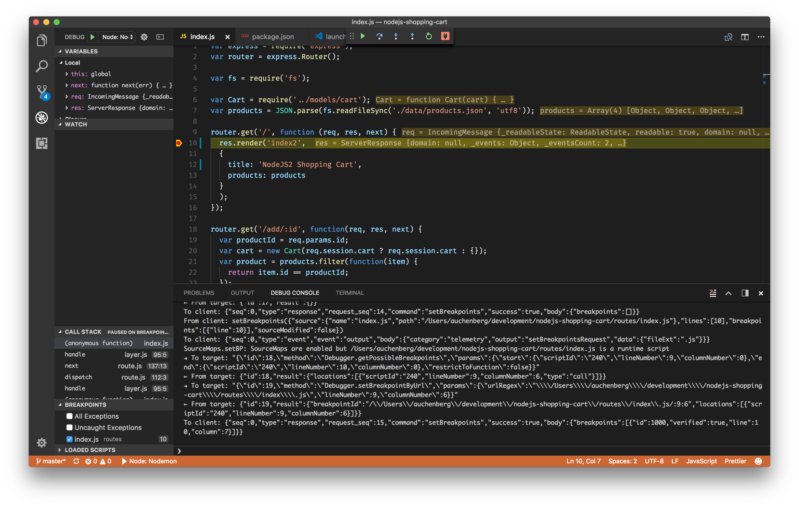

# Node.js debugging in VS Code with Nodemon

By [Kenneth Auchenberg](https://twitter.com/auchenberg)

This recipe shows how to use the built-in Node Debugger to debug Nodejs applications that use [Nodemon](https://nodemon.io/).

Nodemon is a utility that will monitor for any changes in your source and automatically restart your server, and our Node debugger for VS Code supports automatic re-attaching to the Node process.

We recommend that you use our Node debugger in an `attach` configuration that's attaching to your Node process running.

## Getting Started

1. Make sure to have the latest version of VS Code installed.

2. This guide assumes that you are using the official sample app [nodejs-shopping-cart](https://github.com/gtsopour/nodejs-shopping-cart). Clone the repo to get started
    >
    ```
    git clone git@github.com:gtsopour/nodejs-shopping-cart.git
    cd nodejs-shopping-cart
    npm install
    code .
    ```

## Configure VS Code debugging with a launch.json file

1. Click on the Debugging icon in the Activity Bar to bring up the Debug view.
Then click on the gear icon to configure a launch.json file, selecting **Node** for the environment:

   

2. Replace content of the generated launch.json with the following two configurations:

    ```json
    {
        "version": "0.2.0",
        "configurations": [
            {
                "type": "node",
                "request": "launch",
                "name": "Node: Nodemon",
                "runtimeExecutable": "npm",
                "runtimeArgs": ["start"],
                "outputCapture": "std",
            },
        ]
    }
    ```

## Start your node app via your new NPM script

The next step is to start your Node app via your new `npm run debug` script. We can highly recommend using the integrated console in VS Code.



## Debugging the Node process

  1. Go to the Debug view, select the **'Node: Nodemon'** configuration, then press F5 or click the green play button.

  2. VS Code should now attempt to start your Meteor app.

  3. Go ahead and set a breakpoint in **routes/index.js** on `line 10` within the `route handler` function.



  4. Open your favorite browser and go to `http://localhost:3000`

  5. Your breakpoint should now be hit.

  6. Try to make a change to **routes/index.js**.

  7. Nodemon should kick in after the change, and you should see VS Code re-attach to the newly spawned Node process automatically.

  8. Party 🎉🔥

